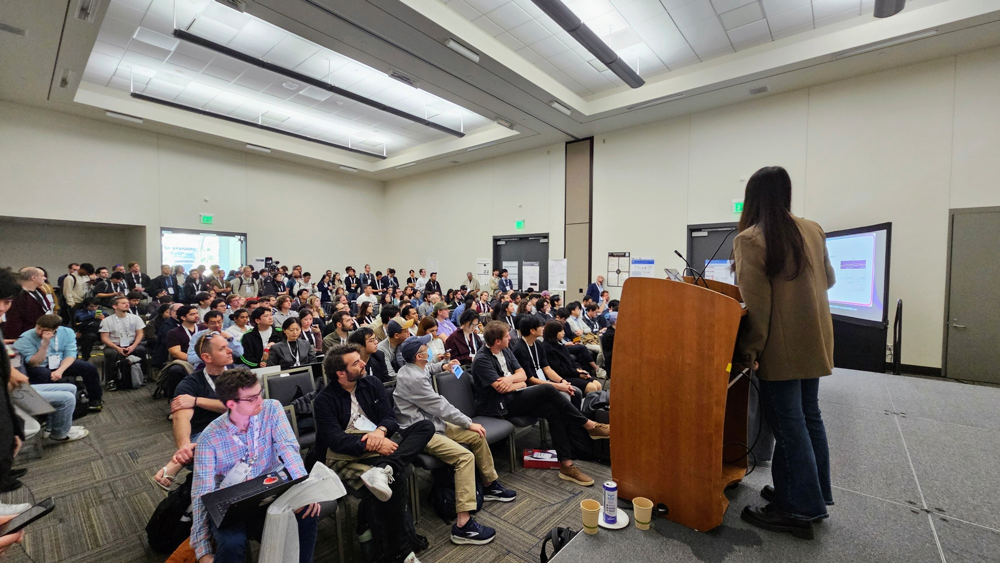
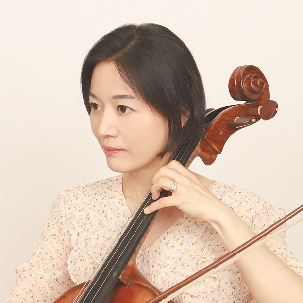
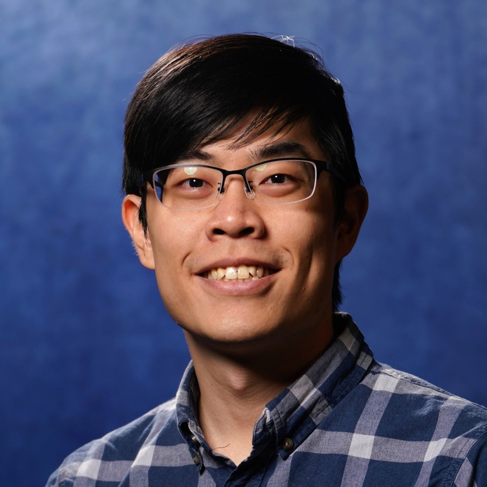

# **ICML 2026 Workshop on AI for Music:**{:.accent2} *Exploring Human-AI Music Co-creativity*{:.accent}

> July 10 or 11 @ [COEX Convention & Exhibition Center](https://maps.app.goo.gl/mogfra4r9PUq5X4T9), Seoul, Korea\\
> Contact: <aiformusicworkshop@gmail.com>

---

Shortcuts

- [📸 Last Workshop's Highlights](#highlights)
- [ℹ️ Description](#description)
- [📢 Call for Papers & Demos](#cfp)
- [📅 Schedule](#schedule)
- [💡 Invited Speakers](#speakers)
- [🤩 Organizers](#organizers)
- [🔄 Previous Iterations](#iterations)

---

## 📸 Last Workshop's Highlights {#highlights}

---

## ℹ️ Description {#description}

This workshop explores the dynamic intersection of AI and music, a rapidly evolving field where creativity meets computation. Music is one of the most universal and emotionally resonant forms of human expression. Producing, understanding, and processing music presents unique challenges for machine learning due to its creative, expressive, subjective, and interactive nature. According to the IFPI Global Music Report 2025 published by the International Federation of the Phonographic Industry (IFPI), "*AI will be one of the defining issues of our time and record companies have embraced its potential to enhance artist creativity and develop new and exciting fan experiences.*" AI has tremendous impacts on all aspects of music, across composition, production, performance, distribution, and education. Recent years have also seen rapidly growing interests among the machine learning community in AI music research. In this first NeurIPS workshop dedicated to music since 2011, we want to bring together the music and AI communities to facilitate a timely, interdisciplinary conversation on the status and future of AI for music.

The goal of this workshop is twofold: First, we aim to explore the latest advancements of AI's applications for music, from analysis, creation, performance, production, retrieval to music education and therapy. Second, we aim to discuss the impacts and implications of AI in music, including AI's impacts on the music industry, musician community, and music education as well as ethical, legal and societal implications of AI music and AI's implications for future musicians. We will emphasize networking and community building in this workshop to generate a sustainable research momentum.

The workshop will feature invited talks, contributed spotlight presentations, a poster and demo session, a panel discussion, and round table discussions. We have invited six speakers from a diverse background who will bring interdisciplinary perspectives to the audience. We will solicit original 4-page papers from the community. We will also call for demos accompanied by 2-page extended abstracts to accommodate the various formats AI music innovations may take.

---

## 📢 Call for Papers & Demos {#cfp}

We invite contributions from the community on relevant topics of AI and music, *broadly defined*. This workshop is **non-archival**{:.accent}. Accepted papers will be posted on the workshop website but will not be published or archived. We welcome work that is under review or to be submitted to other venues.

**Submission portal**{:.accent}: TBA

### Call for Papers

We call for original **4-page papers**{:.accent} (excluding references) on relevant topics of AI and music, broadly defined. We encourage and welcome papers discussing initial concepts, early results, and promising directions. All accepted papers will be presented in the poster and demo session. A small number of papers will be selected for 10-min spotlight presentations. The review process will be **double-blind**{:.accent}.

### Call for Demos

We call for demos of novel AI music tools and artistic work. Each demo submission will be accompanied by a **2-page extended abstract**{:.accent} (excluding references). We encourage the authors to submit an **optional short video recording**{:.accent} (no longer than 10 min) as supplementary materials. The selected demos will each be assigned a poster board in the poster and demo session. The goal of the demo session is to accommodate the various forms that novel AI music innovations may take, and thus we will adopt a **single-blind**{:.accent} review process.

### Important Dates

The following due dates apply to both paper and demo submissions:

- **Submission Deadline:**{:.accent} **April 24, AoE**{:.red}
- Author Notification Date: May 15, AoE
- Camera-ready Due: November 7, AoE

### Topics of Interest

Topics of interest include, but not limited to:

- **Applications of AI in music**
  - Music theory & musicology
  - Optical music recognition
  - Music transcription
  - Music generation
  - Sound design & soundtrack generation
  - Singing voice synthesis
  - Lyric generation and translation
  - Musical instrument design
  - Robotic musicianship
  - Human-AI music co-creativity
  - Music production
  - Music performance modeling
  - Music information retrieval
  - Music recommender systems
  - Music education
  - Music therapy
  {:.two-column}
- **Impacts & implications of AI in music**
  - Impacts on music industry
  - Impacts on the musician community
  - Impacts on music education
  - Implications for future musicians
  - Ethical, legal & societal implications of AI music
  - Challenges in commercializing AI music tools
  - Emerging opportunities of AI music
  {:.two-column}

---

## 📅 Schedule {#schedule}

|||
|:-:|--|
| 8:00  - 8:10  | Opening Remarks                              |
| 8:10  - 8:40  | **Invited Talk** by TBD                      |
| 8:40  - 9:10  | **Invited Talk** by TBD                      |
| 9:10  - 10:30 | ☕Coffee Break + **Posters & Demos I**       |
| 10:30 - 11:00 | **Oral Presentations**                       |
| 11:00 - 11:30 | **Invited Talk** by TBD                      |
| 11:30 - 12:00 | **Invited Talk** by TBD                      |
| 12:00 - 1:00  | 🍴Lunch Break                                |
| 1:00  - 1:30  | **Oral Presentations**                       |
| 1:30  - 2:00  | **Invited Talk** by TBD                      |
| 2:00  - 2:30  | **Invited Talk** by TBD                      |
| 2:30  - 3:50  | ☕Coffee Break + **Posters & Demos II**      |
| 3:50  - 4:50  | **Panel Discussion** (with invited speakers) |
| 4:50  - 5:00  | Closing Remarks                              |

---

## 💡 Invited Speakers {#speakers}

TBD

---

## 🤩 Organizers {#organizers}

  
  

  **[Yung-Hsiang Lu](https://yhlu.net/)** is a Professor in the Elmore Family School of Electrical and Computer Engineering at Purdue University. He is a fellow of the IEEE and a distinguished scientist of the ACM. Yung-Hsiang has published papers on computer vision and machine learning in venues such as AI Magazine, Nature Machine Learning, and Computer. He is one of the editors of the book "Low-Power Computer Vision: Improve the Efficiency of Artificial Intelligence" (ISBN 9780367744700, 2022 by Chapman & Hall).
  

  
  

  **[Kristen Yeon-Ji Yun](https://kristenyeonjiyun.com/)** is a Clinical Associate Professor in the Department of Music at the Patti and Rusty Rueff School of Design, Art, and Performance at Purdue University. She is the Principal Investigator of the research project "Artificial Intelligence Technology for Future Music Performers" (US National Science Foundation, IIS 2326198). Kristen is an active soloist, chamber musician, musical scholar, and clinician. She has toured many countries, including Malaysia, Thailand, Germany, Mexico, Japan, China, Hong Kong, Spain, France, Italy, Taiwan, and South Korea, giving a series of successful concerts and master classes.
  

  
  

  **[Hao-Wen (Herman) Dong](https://hermandong.com/)** is an Assistant Professor in the Department of Performing Arts Technology at the University of Michigan. Herman's research aims to augment human creativity with machine learning. He develops human-centered generative AI technology that can be integrated into the professional creative workflow, with a focus on music, audio and video content creation. His long-term goal is to lower the barrier of entry for content creation and democratize professional content creation for everyone. Herman received his PhD degree in Computer Science from University of California San Diego, where he worked with Julian McAuley and Taylor Berg-Kirkpatrick. His research has been recognized by the UCSD CSE Doctoral Award for Excellence in Research, KAUST Rising Stars in AI, UChicago and UCSD Rising Stars in Data Science, ICASSP Rising Stars in Signal Processing, and UCSD GPSA Interdisciplinary Research Award.
  

---

## 🔄 Previous Iterations {#iterations}

- [AAAI 2025](https://ai4musicians.org/2025aaai.html)
- [ICME 2025](https://ai4musicians.org/2025icme.html)
- [NeurIPS 2025](https://aiformusicworkshop.github.io/)
