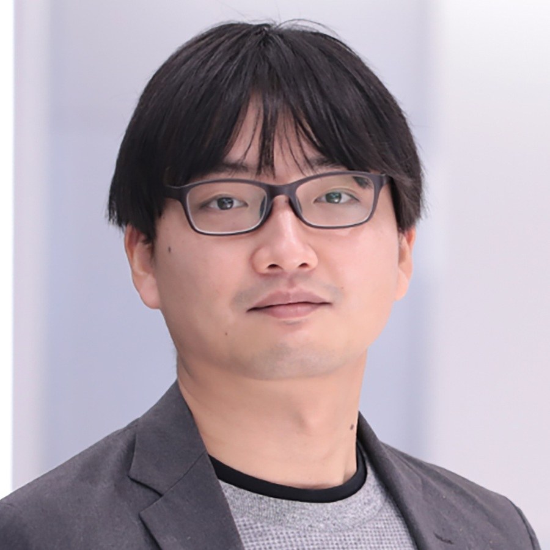

# **NeurIPS 2025 Workshop on AI for Music:**{:.accent2} *Where Creativity Meets Computation*{:.accent}

> December 7 @ [Room 27](location.png), [San Diego Convention Center](https://maps.app.goo.gl/gTF1wUrJ5vtSeEUU6)\\
> Contact: <aiformusicworkshop@gmail.com>\\
> [Register here!](https://nips.cc/Register/view-registration) (A "Workshops & Competitions" pass is required to attend the workshop.)

---

Shortcuts

- [ℹ️ Description](#description)
- [📅 Schedule](#schedule)
- [💡 Invited Speakers](#speakers)
- [🤩 Organizers](#organizers)
- [🔍 Program Committee](#committee)
- [🤝 Sponsors](#sponsors)
- [📜 Accepted Papers & Demos](#papers_demos)
- [📢 Call for Papers & Demos](#cfp)
- [🔄 Previous Iterations](#iterations)

---

## ℹ️ Description {#description}

This workshop explores the dynamic intersection of AI and music, a rapidly evolving field where creativity meets computation. Music is one of the most universal and emotionally resonant forms of human expression. Producing, understanding, and processing music presents unique challenges for machine learning due to its creative, expressive, subjective, and interactive nature. According to the IFPI Global Music Report 2025 published by the International Federation of the Phonographic Industry (IFPI), "*AI will be one of the defining issues of our time and record companies have embraced its potential to enhance artist creativity and develop new and exciting fan experiences.*" AI has tremendous impacts on all aspects of music, across composition, production, performance, distribution, and education. Recent years have also seen rapidly growing interests among the machine learning community in AI music research. In this first NeurIPS workshop dedicated to music since 2011, we want to bring together the music and AI communities to facilitate a timely, interdisciplinary conversation on the status and future of AI for music.

The goal of this workshop is twofold: First, we aim to explore the latest advancements of AI's applications for music, from analysis, creation, performance, production, retrieval to music education and therapy. Second, we aim to discuss the impacts and implications of AI in music, including AI's impacts on the music industry, musician community, and music education as well as ethical, legal and societal implications of AI music and AI's implications for future musicians. We will emphasize networking and community building in this workshop to generate a sustainable research momentum.

The workshop will feature invited talks, contributed spotlight presentations, a poster and demo session, a panel discussion, and round table discussions. We have invited six speakers from a diverse background who will bring interdisciplinary perspectives to the audience. We will solicit original 4-page papers from the community. We will also call for demos accompanied by 2-page extended abstracts to accommodate the various formats AI music innovations may take.

---

## 📅 Schedule {#schedule}

|||
|:-:|--|
| 8:00  - 8:10  | Opening Remarks                                           |
| 8:10  - 8:40  | **Invited Talk** by [Chris Donahue](https://chrisdonahue.com/) (CMU & Google Deepmind) *Quantifying creativity? Rigorous evaluation for music AI*{:.accent} |
| 8:40  - 9:10  | **Invited Talk** by [Shlomo Dubnov](http://dub.ucsd.edu/) (UC San Diego) *Music Co-creativity with AI*{:.accent} |
| 9:10  - 10:10 | ☕Coffee Break + **[Posters & Demos I](#papers_demos)**   |
| 10:10 - 10:40 | **Lightning Talks**                                       |
| 10:40 - 11:10 | **Oral Presentations** *StylePitcher: Generating Style-Following, Expressive Pitch Curves for Versatile Singing Tasks*{:.accent} Jingyue Huang, Qihui Yang, Fei-Yueh Chen, Randal Leistikow, Yongyi Zang *E-Motion Baton: Human-in-the-Loop Music Generation via Expression and Gesture*{:.accent} Mingchen Ma, Stephen Ni-Hahn, Simon Mak, Yue Jiang, Cynthia Rudin |
| 11:10 - 11:40 | **Invited Talk** by [Ilaria Manco](https://ilariamanco.com/) (Google Deepmind) *Real-time Music Generation: Lowering Latency and Increasing Control*{:.accent} |
| 11:40 - 12:10 | **Invited Talk** by [Akira Maezawa](https://www.linkedin.com/in/akira-maezawa-7662a655/) (Yamaha) *Design of AI-based Interactive Music Performance Systems in the Wild*{:.accent} |
| 12:10 - 1:10  | 🍴Lunch Break (🥪box lunch provided)                     |
| 1:10  - 2:00  | **[Posters & Demos II](#papers_demos)**                   |
| 2:00  - 2:30  | **Invited Talk** by [Julian McAuley](https://cseweb.ucsd.edu/~jmcauley/) (UC San Diego) *Opportunities and Challenges in Music Recommendation*{:.accent} |
| 2:30  - 3:00  | **Invited Talk** by [Anna Huang](https://czhuang.github.io/) (MIT) *In Search of Human-AI Resonance*{:.accent} |
| 3:00  - 4:00  | ☕Coffee Break + **[Posters & Demos III](#papers_demos)** |
| 4:00  - 4:50  | **Panel Discussion** (with invited speakers)              |
| 4:50  - 5:00  | Closing Remarks                                           |

---

## 💡 Invited Speakers {#speakers}

  
  

  **[Chris Donahue](https://chrisdonahue.com/)** is the Dannenberg Assistant Professor in the Computer Science Department (CSD) at Carnegie Mellon University, and a part-time Research Scientist at Google DeepMind. At CMU, Chris leads the Generative Creativity Lab (G-CLef), with a mission to empower and enrich human creativity and productivity with generative AI. This primarily involves work at the intersection of music and AI, though also includes work on other applications such as code, gaming, and language. Chris's research has also translated to real-world impact in music, from integration into performances by professional bands (The Flaming Lips) to consumer music AI tools (Beat Sage, Hookpad Aria) that have been used hundreds of thousands of times. Before CMU, Chris was a postdoctoral scholar in the CS department at Stanford advised by Percy Liang. Chris holds a PhD from UC San Diego where he was jointly advised by Miller Puckette (music) and Julian McAuley (CS).
  

  
  

  **[Shlomo Dubnov](http://dub.ucsd.edu/)** is a Professor in the Music Department and Affiliate Professor in Computer Science and Engineering at the University of California San Diego. He is also the Director of the Center for Research in Entertainment and Learning at Qualcomm Institute. He is best known for his research on poly-spectral analysis of musical timbre and inventing the method of Music Information Dynamics with applications in Computer Audition and Machine improvisation.
  

  
  

  **[Ilaria Manco](https://ilariamanco.com/)** is a Research Scientist in the Magenta team at Google DeepMind. Her research spans music generation and understanding, with a current focus on new forms of musical interaction via controllable, real-time generative models. Ilaria received her PhD from Queen Mary University of London, where she developed multimodal representation learning approaches to connect music and language for a variety of music understanding tasks.
  

  
  

  **[Akira Maezawa](https://www.linkedin.com/in/akira-maezawa-7662a655/)** leads music informatics research group MINA Lab at Yamaha, where he and his team have developed music technologies integrated into mobile applications, digital instruments, and interactive systems featured in concert events and installations around the world. The projects he has led have earned numerous awards and distinctions, including the Entertainment Lions for Music at the Cannes Lions International Festival of Creativity and the Research and Engineering Award from the Information Processing Society of Japan.
  

  
  

  **[Julian McAuley](https://cseweb.ucsd.edu/~jmcauley/)** is a Professor in the Department of Computer Science and Engineering at the University of California San Diego. He works on applications of machine learning to problems involving personalization, and teaches classes on personalized recommendation. He likes bicycling and baroque keyboard.
  

  
  

  **[Anna Huang](https://czhuang.github.io/)** is an Associate Professor at MIT, with a shared position in Music and Theater Arts (MTA) and Electrical Engineering and Computer Science (EECS). She joined MIT last Fall to help start a new graduate program in Music Technology and Computation. This year, she is the Rieman and Baketel Fellow for Music at the Harvard Radcliffe Institute. For the past decade, she has been part of the Magenta team in Google Brain and then Google DeepMind, spearheading efforts in generative modeling, reinforcement learning, and human-computer interaction. In 2017, she created Music Transformer, the first successful adaptation of the transformer architecture to music. She is also the creator of the machine learning model Coconet that powered Google Bach Doodle, which in two days harmonized 55 million melodies from users around the world. From 2020-2022, she was a judge and organizer for the AI Song Contest. Now at MIT, she directs the Human-AI Resonance Lab (HAI-Res, pronounced Hi-Res) at CSAIL (Computer Science and Artificial Intelligence Laboratory).
  

---

## 🤩 Organizers {#organizers}

  
  

  **[Hao-Wen (Herman) Dong](https://hermandong.com/)** is an Assistant Professor in the Department of Performing Arts Technology at the University of Michigan. Herman's research aims to augment human creativity with machine learning. He develops human-centered generative AI technology that can be integrated into the professional creative workflow, with a focus on music, audio and video content creation. His long-term goal is to lower the barrier of entry for content creation and democratize professional content creation for everyone. Herman received his PhD degree in Computer Science from University of California San Diego, where he worked with Julian McAuley and Taylor Berg-Kirkpatrick. His research has been recognized by the UCSD CSE Doctoral Award for Excellence in Research, KAUST Rising Stars in AI, UChicago and UCSD Rising Stars in Data Science, ICASSP Rising Stars in Signal Processing, and UCSD GPSA Interdisciplinary Research Award.
  

  
  

  **[Zachary Novack](https://zacharynovack.github.io/)** is a PhD student in the Computer Science and Engineering department at the University of California San Diego, advised by Dr. Julian McAuley and Dr. Taylor Berg-Kirkpatrick. His research focuses on controllable and efficient music/audio generation, as well as audio reasoning in LLMs. His long-term goal is to design bespoke creative tools for musicians and everyday users alike with adaptive control and real-time interaction, collaborating with top industry labs such as Adobe Research, Stability AI, and Sony AI. Zachary's work has been recognized at numerous top-tier AI conferences, including DITTO (ICML 2024 Oral), *Presto!* (ICLR 2025 Spotlight), CoLLAP (ICASSP 2025 Oral). Outside of academia, Zachary is active within the southern California marching arts community, working as an educator for the 11-time world class finalist percussion ensemble POW Percussion.
  

  
  

  **[Yung-Hsiang Lu](https://yhlu.net/)** is a Professor in the Elmore Family School of Electrical and Computer Engineering at Purdue University. He is a fellow of the IEEE and a distinguished scientist of the ACM. Yung-Hsiang has published papers on computer vision and machine learning in venues such as AI Magazine, Nature Machine Learning, and Computer. He is one of the editors of the book "Low-Power Computer Vision: Improve the Efficiency of Artificial Intelligence" (ISBN 9780367744700, 2022 by Chapman & Hall).
  

  
  

  **[Kristen Yeon-Ji Yun](https://kristenyeonjiyun.com/)** is a Clinical Associate Professor in the Department of Music at the Patti and Rusty Rueff School of Design, Art, and Performance at Purdue University. She is the Principal Investigator of the research project "Artificial Intelligence Technology for Future Music Performers" (US National Science Foundation, IIS 2326198). Kristen is an active soloist, chamber musician, musical scholar, and clinician. She has toured many countries, including Malaysia, Thailand, Germany, Mexico, Japan, China, Hong Kong, Spain, France, Italy, Taiwan, and South Korea, giving a series of successful concerts and master classes.
  

  
  

  **[Benjamin Shiue-Hal Chou](https://www.linkedin.com/in/benjamin-chou-6aa058228/)** is a PhD student in Electrical and Computer Engineering at Purdue University, advised by Dr. Yung-Hsiang Lu. His research focuses on music performance error detection and the design of multimodal architectures. He is the lead author of Detecting Music Performance Errors with Transformers (AAAI 2025) and a co-author of Token Turing Machines are Efficient Vision Models (WACV 2025). Benjamin is the graduate mentor for the Purdue AIM (AI for Musicians) group and has helped organize the Artificial Intelligence for Music workshop at both AAAI 2025 and ICME 2025. He is currently interning at Reality Defender, where he works on audio deepfake detection.
  

---

## 🔍 Program Committee {#committee}

(In alphabetical order)

Erfun Ackley, Julia Barnett, Luca Bindini, Kaj Bostrom, Brandon James Carone, Yunkee Chae, Ke Chen, Xi Chen, Manuel Cherep, Joann Ching, Eunjin Choi, Woosung Choi, Benjamin Shiue-Hal Chou, Annie Chu, Charis Cochran, Frank Cwitkowitz, SeungHeon Doh, Chris Donahue, Hao-Wen Dong, Shlomo Dubnov, Victoria Ebert, Hugo Flores García, Ross Greer, Timothy Greer, Jiarui Hai, Wen-Yi Hsiao, Jiawen Huang, Jingyue Huang, Manh Pham Hung, Yun-Ning Hung, Tatsuro Inaba, Purvish Jajal, Dasaem Jeong, Molly Jones, Kexin Phyllis Ju, Tornike Karchkhadze, Haven Kim, Jinju Kim, Shinae Kim, Soo Yong Kim, Yewon Kim, Yonghyun Kim, Junyoung Koh, Zhifeng Kong, Junghyun Koo, Luca A Lanzendörfer, Jongpil Lee, Junwon Lee, Wei-Jaw Lee, Wo Jae Lee, Bochen Li, Xueyan Li, Duoduo Liao, Jia-Wei Liao, Brian Lindgren, Jeng-Yue Liu, Phillip Long, Yung-Hsiang Lu, Yin-Jyun Luo, Mingchen Ma, Akira Maezawa, Ilaria Manco, Jiawen Mao, Atharva Mehta, Giovana Morais, Oriol Nieto, Stephen Ni-Hahn, Zachary Novack, Patrick O'Reilly, Seungryeol Paik, Ting-Yu Pan, Eleonora Ristori, Iran R Roman, Sherry Ruan, Koichi Saito, Rebecca Salganik, Sridharan Sankaran, Jiatong Shi, Nikhil Singh, Christian J. Steinmetz, Li Su, Chih-Pin Tan, Jiaye Tan, John Thickstun, James Townsend, Fang-Duo Tsai, Teng Tu, Ziyu Wang, Christopher W. White, Shih-Lun Wu, Yusong Wu, Weihan Xu, Xin Xu, Yujia Yan, Chao Peter Yang, Guang Yang, Qihui Yang, Yen-Tung Yeh, Jayeon Yi, Chin-Yun Yu, Kristen Yeon-Ji Yun, Yongyi Zang, Fan Zhang, Wenxin Zhang, Yixiao Zhang, You Zhang, Jingwei Zhao, Ge Zhu

---

## 🤝 Sponsors {#sponsors}

### **Gold Sponsors**{:.gold-sponsor}

  
  

  
  

  

### **Silver Sponsors**{:.silver-sponsor}

  

---

## 📜 Accepted Papers & Demos {#papers_demos}

**Acceptance rate: 68%** (73/108) \| Paper: 69% (59/85) \| Demo: 61% (14/23)

### Accepted Papers {#papers}



- **{{ paper.last.title }}** *Anonymous*

- **{{ paper.last.title }}** {{ paper.last.authors }}



### Accepted Demos {#demos}



- **{{ paper.last.title }}** {{ paper.last.authors }}



---

## 📢 Call for Papers & Demos {#cfp}

We invite contributions from the community on relevant topics of AI and music, *broadly defined*. This workshop is **non-archival**{:.accent}. Accepted papers will be posted on the workshop website but will not be published or archived. We welcome work that is under review or to be submitted to other venues.

**Submission portal**{:.accent}: [openreview.net/group?id=NeurIPS.cc/2025/Workshop/AI4Music](https://openreview.net/group?id=NeurIPS.cc/2025/Workshop/AI4Music)

### Call for Papers

We call for original **4-page papers**{:.accent} (excluding references) on relevant topics of AI and music, broadly defined. We encourage and welcome papers discussing initial concepts, early results, and promising directions. All accepted papers will be presented in the poster and demo session. A small number of papers will be selected for 10-min spotlight presentations. The review process will be **double-blind**{:.accent}.

### Call for Demos

We call for demos of novel AI music tools and artistic work. Each demo submission will be accompanied by a **2-page extended abstract**{:.accent} (excluding references). We encourage the authors to submit an **optional short video recording**{:.accent} (no longer than 10 min) as supplementary materials. The selected demos will each be assigned a poster board in the poster and demo session. The goal of the demo session is to accommodate the various forms that novel AI music innovations may take, and thus we will adopt a **single-blind**{:.accent} review process.

### Important Dates

The following due dates apply to both paper and demo submissions:

- **Submission Deadline:**{:.accent} ~~August 22, AoE~~{:style="text-decoration-thickness: 3px; text-decoration-color: #9F2936"} **August 29, AoE**{:.red}
- Author Notification Date: September 22, AoE
- Camera-ready Due: November 7, AoE

### Topics of Interest

Topics of interest include, but not limited to:

- **Applications of AI in music**
  - Music theory & musicology
  - Optical music recognition
  - Music transcription
  - Music generation
  - Sound design & soundtrack generation
  - Singing voice synthesis
  - Lyric generation and translation
  - Musical instrument design
  - Robotic musicianship
  - Human-AI music co-creativity
  - Music production
  - Music performance modeling
  - Music information retrieval
  - Music recommender systems
  - Music education
  - Music therapy
  {:.two-column}
- **Impacts & implications of AI in music**
  - Impacts on music industry
  - Impacts on the musician community
  - Impacts on music education
  - Implications for future musicians
  - Ethical, legal & societal implications of AI music
  - Challenges in commercializing AI music tools
  - Emerging opportunities of AI music
  {:.two-column}

### Formatting Guide {#formatting}

Please format your paper using the NeurIPS 2025 [LaTeX template](https://neurips.cc/Conferences/2025/CallForPapers).

1. Set the workshop title on line 40:&emsp;`\workshoptitle{AI for Music}`
2. For submission, set the options as follows:

   - Papers:&emsp;`\usepackage[dblblindworkshop]{neurips_2025}`
   - Demos:&emsp;`\usepackage[sglblindworkshop]{neurips_2025}`

3. For camera-ready, set the options as follows:

   - Papers:&emsp;`\usepackage[dblblindworkshop,final]{neurips_2025}`
   - Demos:&emsp;`\usepackage[sglblindworkshop,final]{neurips_2025}`

Note that you do NOT need to include the NeurIPS paper checklist. You may include technical appendices (after the references in the main PDF file) and supplementary material (as a ZIP file up to 100 MB). However, it is up to the reviewer to determine if they want to read them.

For demo submissions, you may provide a short video recording (10 minutes maximum) to support your work. We recommend you to provide a YouTube link (or equivalent) to the video recording. Please make sure you have set the visibility to *public* or *unlisted* on YouTube. Less preferably, you may upload the video recording as an MP4 file (100 MB maximum).

---

## 🔄 Previous Iterations {#iterations}

- [AAAI 2025](https://ai4musicians.org/2025aaai.html)
- [ICME 2025](https://ai4musicians.org/2025icme.html)
