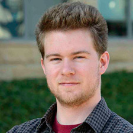

# **NeurIPS 2025 Workshop on AI for Music:**{:.accent2} *Where Creativity Meets Computation*{:.accent}

> December 6 or 7 @ San Diego Convention Center\\
> Contact: <aiformusicworkshop@gmail.com>

---

## Description

This workshop explores the dynamic intersection of AI and music, a rapidly evolving field where creativity meets computation. Music is one of the most universal and emotionally resonant forms of human expression. Producing, understanding, and processing music presents unique challenges for machine learning due to its creative, expressive, subjective, and interactive nature. According to the IFPI Global Music Report 2025 published by the International Federation of the Phonographic Industry (IFPI), "*AI will be one of the defining issues of our time and record companies have embraced its potential to enhance artist creativity and develop new and exciting fan experiences.*" AI has tremendous impacts on all aspects of music, across composition, production, performance, distribution, and education. Recent years have also seen rapidly growing interests among the machine learning community in AI music research. In this first NeurIPS workshop dedicated to music since 2011, we want to bring together the music and AI communities to facilitate a timely, interdisciplinary conversation on the status and future of AI for music.

The goal of this workshop is twofold: First, we aim to explore the latest advancements of AI's applications for music, from analysis, creation, performance, production, retrieval to music education and therapy. Second, we aim to discuss the impacts and implications of AI in music, including AI's impacts on the music industry, musician community, and music education as well as ethical, legal and societal implications of AI music and AI's implications for future musicians. We will emphasize networking and community building in this workshop to generate a sustainable research momentum.

The workshop will feature invited talks, contributed spotlight presentations, a poster and demo session, a panel discussion, and round table discussions. We have invited six speakers from a diverse background who will bring interdisciplinary perspectives to the audience. We will solicit original 4-page papers from the community. We will also call for demos accompanied by 2-page extended abstracts to accommodate the various formats AI music innovations may take.

---

## Call for Papers & Demos

We invite contributions from the community on relevant topics of AI and music, *broadly defined*. This workshop is **non-archival**{:.accent}. Accepted papers will be posted on the workshop website but will not be published or archived. We welcome work that is under review or to be submitted to other venues.

**Submission portal**{:.accent}: [openreview.net/group?id=NeurIPS.cc/2025/Workshop/AI4Music](https://openreview.net/group?id=NeurIPS.cc/2025/Workshop/AI4Music)

### Call for Papers

We call for original **4-page papers**{:.accent} (excluding references) on relevant topics of AI and music, broadly defined. We encourage and welcome papers discussing initial concepts, early results, and promising directions. All accepted papers will be presented in the poster and demo session. A small number of papers will be selected for 10-min spotlight presentations. The review process will be **double-blind**{:.accent}.

### Call for Demos

We call for demos of novel AI music tools and artistic work. Each demo submission will be accompanied by a **2-page extended abstract**{:.accent} (excluding references). We encourage the authors to submit an **optional short video recording**{:.accent} (no longer than 10 min) as supplementary materials. The selected demos will each be assigned a poster board in the poster and demo session. The goal of the demo session is to accommodate the various forms that novel AI music innovations may take, and thus we will adopt a **single-blind**{:.accent} review process.

### Important Dates

The following due dates apply to both paper and demo submissions:

- **Submission Deadline:**{:.accent} **August 22, AoE**{:.red}
- Author Notification Date: September 22, AoE
- Camera-ready Due: November 7, AoE

### Topics of Interest

Topics of interest include, but not limited to:

- **Applications of AI in music**
  - Music theory & musicology
  - Optical music recognition
  - Music transcription
  - Music generation
  - Sound design & soundtrack generation
  - Singing voice synthesis
  - Lyric generation and translation
  - Musical instrument design
  - Robotic musicianship
  - Human-AI music co-creativity
  - Music production
  - Music performance modeling
  - Music information retrieval
  - Music recommender systems
  - Music education
  - Music therapy
  {:.two-column}
- **Impacts & implications of AI in music**
  - Impacts on music industry
  - Impacts on the musician community
  - Impacts on music education
  - Implications for future musicians
  - Ethical, legal & societal implications of AI music
  - Challenges in commercializing AI music tools
  - Emerging opportunities of AI music
  {:.two-column}

### Formatting Guide

Please format your paper using the NeurIPS 2025 [LaTeX template](https://neurips.cc/Conferences/2025/CallForPapers).

1. Set the workshop title on line 40:&emsp;`\workshoptitle{AI for Music}`
2. For submission, set the options as follows:

   - Papers:&emsp;`\usepackage[dblblindworkshop]{neurips_2025}`
   - Demos:&emsp;`\usepackage[sglblindworkshop]{neurips_2025}`

3. For camera-ready, set the options as follows:

   - Papers:&emsp;`\usepackage[dblblindworkshop,final]{neurips_2025}`
   - Demos:&emsp;`\usepackage[sglblindworkshop,final]{neurips_2025}`

You may include technical appendices and supplementary material. However, it is up to the reviewer to determine if they want to read them.

---

## Tentative Schedule

|||
|:-:|--|
| 8:20  - 8:30  | Welcoming Remarks                                      |
| 8:30  - 9:00  | **Invited Talk** by [Chris Donahue](https://chrisdonahue.com/) (CMU) *The Expanding Horizons of Generative Music AI Research*{:.accent} |
| 9:00  - 9:30  | **Invited Talk** by [Shlomo Dubnov](http://dub.ucsd.edu/) (UC San Diego) *Music Co-creativity with AI*{:.accent} |
| 9:30  - 10:00 | **Invited Talk** by [Ilaria Manco](https://ilariamanco.com/) (Google Deepmind) *Real-time Music Generation: Lowering Latency and Increasing Control*{:.accent} |
| 10:00 - 10:30 | Coffee Break                                           |
| 10:30 - 11:00 | **Spotlight Presentations**                            |
| 11:00 - 12:00 | **Poster & Demo Session**                              |
| 12:00 - 1:30  | Lunch Break                                            |
| 1:30  - 2:00  | **Invited Talk** by [Akira Maezawa](https://www.linkedin.com/in/akira-maezawa-7662a655/) (Yamaha) *Assisting Music Performance through AI*{:.accent} |
| 2:00  - 2:30  | **Invited Talk** by [Anna Huang](https://czhuang.github.io/) (MIT) *In Search of Human-AI Resonance*{:.accent} |
| 2:30  - 3:00  | **Invited Talk** by [Julian McAuley](https://cseweb.ucsd.edu/~jmcauley/) (UC San Diego) *Recommendation and Personalization for Music*{:.accent} |
| 3:00  - 3:30  | Coffee Break                                           |
| 3:30  - 4:15  | **Panel Discussion** (with invited speakers)           |
| 4:15  - 5:00  | **Round Table Discussions** (themed group discussions) |
| 5:00  - 5:10  | Closing Remarks                                        |

---

## Invited Speakers

| [{:.headshot}](https://chrisdonahue.com/) | **[Chris Donahue](https://chrisdonahue.com/)** is an Assistant Professor in the Computer Science Department at the Carnegie Mellon University, and a part-time research scientist at Google DeepMind. His research goal is to develop and responsibly deploy generative AI for music and creativity, thereby unlocking and augmenting human creative potential. His research has been featured in live performances by professional musicians like [The Flaming Lips](https://magenta.tensorflow.org/fruitgenie), and also empowers hundreds of daily users to convert their favorite music into interactive content through his website [Beat Sage](https://www.roadtovr.com/beat-saber-project-uses-ai-generate-custom-beat-maps-song/). |
| [{:.headshot}](http://dub.ucsd.edu/) | **[Shlomo Dubnov](http://dub.ucsd.edu/)** is a Professor in the Music Department and Affiliate Professor in Computer Science and Engineering at the University of California San Diego. He is also the Director of the Center for Research in Entertainment and Learning at Qualcomm Institute. He is best known for his research on poly-spectral analysis of musical timbre and inventing the method of Music Information Dynamics with applications in Computer Audition and Machine improvisation. |
| [{:.headshot}](https://ilariamanco.com/) | **[Ilaria Manco](https://ilariamanco.com/)** is a Research Scientist at Google Deepmind. She works on music understanding and generative models for interactive, real-time music creation. Her Phd dissertation focused on developing multimodal deep learning methods to enable music understanding by learning representations from audio and language. |
| [{:.headshot}](https://www.linkedin.com/in/akira-maezawa-7662a655/) | **[Akira Maezawa](https://www.linkedin.com/in/akira-maezawa-7662a655/)** is a Principal Senior Engineer at Yamaha Corporation. He has been leading the music informatics applications lab in the MINA Lab based in Yokohama. He works on AI music ensemble technology that will allow AI to perform together with people, and technology that predicts musical metadata – such as beats – from musical acoustic signals. He also interacts with customers at experience-based installations and hold discussions at universities and with artists, to see how people are actually using the technologies we create in the real world. |
| [{:.headshot}](https://czhuang.github.io/) | **[Anna Huang](https://czhuang.github.io/)** is an Assistant Professor at the Massachusetts Institute of Technology, with a shared position between Electrical Engineering and Computer Science (EECS) and Music and Theater Arts (MTA). She is the creator of the ML model Coconet that powered Google's first AI Doodle, the [Bach Doodle](https://magenta.tensorflow.org/coconet). In two days, Coconet harmonized 55 million melodies from users around the world. In 2018, she created [Music Transformer](https://magenta.tensorflow.org/music-transformer), a breakthrough in generating music with long-term structure, and the first successful adaptation of the transformer architecture to music. She was a Canada CIFAR AI Chair at Mila. |
| [{:.headshot}](https://cseweb.ucsd.edu/~jmcauley/) | **[Julian McAuley](https://cseweb.ucsd.edu/~jmcauley/)** is a Professor in the Department of Computer Science and Engineering at the University of California San Diego. He works on applications of machine learning to problems involving personalization, and teaches classes on personalized recommendation. He has also been leading the [MUSAIC](https://ucsd-musaic.github.io/) team at UCSD. His lab has significant contributions to machine music understanding, symbolic music processing, music generation, NLP for music, and audiovisual learning. |

---

## Organizers

| [{:.headshot}](https://hermandong.com/) | **[Hao-Wen (Herman) Dong](https://hermandong.com/)** is an Assistant Professor in the Department of Performing Arts Technology at the University of Michigan. Herman's research aims to augment human creativity with machine learning. He develops human-centered generative AI technology that can be integrated into the professional creative workflow, with a focus on music, audio and video content creation. His long-term goal is to lower the barrier of entry for content creation and democratize professional content creation for everyone. Herman received his PhD degree in Computer Science from University of California San Diego, where he worked with Julian McAuley and Taylor Berg-Kirkpatrick. His research has been recognized by the UCSD CSE Doctoral Award for Excellence in Research, KAUST Rising Stars in AI, UChicago and UCSD Rising Stars in Data Science, ICASSP Rising Stars in Signal Processing, and UCSD GPSA Interdisciplinary Research Award. |
| [{:.headshot}](https://zacharynovack.github.io/) | **[Zachary Novack](https://zacharynovack.github.io/)** is a PhD student in the Computer Science and Engineering department at the University of California San Diego, advised by Dr. Julian McAuley and Dr. Taylor Berg-Kirkpatrick. His research focuses on controllable and efficient music/audio generation, as well as audio reasoning in LLMs. His long-term goal is to design bespoke creative tools for musicians and everyday users alike with adaptive control and real-time interaction, collaborating with top industry labs such as Adobe Research, Stability AI, and Sony AI. Zachary's work has been recognized at numerous top-tier AI conferences, including DITTO (ICML 2024 Oral), *Presto!* (ICLR 2025 Spotlight), CoLLAP (ICASSP 2025 Oral). Outside of academia, Zachary is active within the southern California marching arts community, working as an educator for the 11-time world class finalist percussion ensemble POW Percussion. |
| [{:.headshot}](https://yhlu.net/) | **[Yung-Hsiang Lu](https://yhlu.net/)** is a Professor in the Elmore Family School of Electrical and Computer Engineering at Purdue University. He is a fellow of the IEEE and a distinguished scientist of the ACM. Yung-Hsiang has published papers on computer vision and machine learning in venues such as AI Magazine, Nature Machine Learning, and Computer. He is one of the editors of the book ``Low-Power Computer Vision: Improve the Efficiency of Artificial Intelligence'' (ISBN 9780367744700, 2022 by Chapman & Hall). |
| [{:.headshot}](https://kristenyeonjiyun.com/) | **[Kristen Yeon-Ji Yun](https://kristenyeonjiyun.com/)** is a Clinical Associate Professor in the Department of Music at the Patti and Rusty Rueff School of Design, Art, and Performance at Purdue University. She is the Principal Investigator of the research project "Artificial Intelligence Technology for Future Music Performers" (US National Science Foundation, IIS 2326198). Kristen is an active soloist, chamber musician, musical scholar, and clinician. She has toured many countries, including Malaysia, Thailand, Germany, Mexico, Japan, China, Hong Kong, Spain, France, Italy, Taiwan, and South Korea, giving a series of successful concerts and master classes. |
| [{:.headshot}](https://www.linkedin.com/in/benjamin-chou-6aa058228/) | **[Benjamin Shiue-Hal Chou](https://www.linkedin.com/in/benjamin-chou-6aa058228/)** is a PhD student in Electrical and Computer Engineering at Purdue University, advised by Dr. Yung-Hsiang Lu. His research focuses on music performance error detection and the design of multimodal architectures. He is the lead author of Detecting Music Performance Errors with Transformers (AAAI 2025) and a co-author of Token Turing Machines are Efficient Vision Models (WACV 2025). Benjamin is the graduate mentor for the Purdue AIM (AI for Musicians) group and has helped organize the Artificial Intelligence for Music workshop at both AAAI 2025 and ICME 2025. He is currently interning at Reality Defender, where he works on audio deepfake detection. |

---

## Program Committee

(In alphabetical order)

Erfun Ackley, Julia Barnett, Ke Chen, Yu-Hua Chen, Benjamin Shiue-Hal Chou, Annie Chu, Chris Donahue, Hao-Wen Dong, Zhiyao Duan, Shlomo Dubnov, Satoru Fukayama, Hugo Flores García, Dorien Herremans, Wen-Yi Hsiao, Jiawen Huang, Jingyue Huang, Yun-Ning Hung, Purvish Jajal, Dasaem Jeong, Molly Jones, Tornike Karchkhadze, Junghyun (Tony) Koo, Yung-Hsiang Lu, Yin-Jyun Luo, Akira Maezawa, Ilaria Manco, Jiawen Mao, Oriol Nieto, Zachary Novack, Patrick O'Reilly, Ting-Yu Pan, Bryan Pardo, Nikhil Singh, Christian Steinmetz, Li Su, Jiaye Tan, John Thickstun, Fang-Duo Tsai, Mallikarjuna Tupakula, Ziyu Wang, Junda Wu, Shih-Lun Wu, Yusong Wu, Xin Xu, Weihan Xu, Jayeon Yi, Chin-Yun Yu, Kristen Yeon-Ji Yun, Yixiao Zhang, Jingwei Zhao, Ge Zhu

---

## Previous Iterations

- [AAAI 2025](https://ai4musicians.org/2025aaai.html)
- [ICME 2025](https://ai4musicians.org/2025icme.html)
